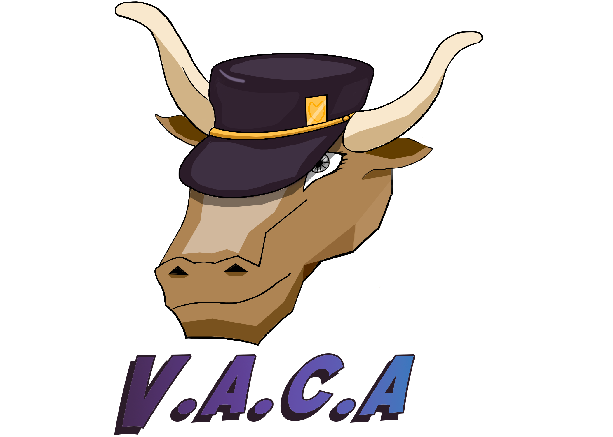

## Bienvenido a la página del equipo alfa super mega dinamita

El nombre de nuestro equipo surgió como una broma que fue demasiado lejos. Somos un grupo de 3 estudiantes que coincidimos **casualmente** en varias asignaturas.

## Miembros
- Edder Hernández Forero (edhernandezfo@unal.edu.co)
- Alberto Nicolai Romero Martínez (anromerom@unal.edu.co)
- Julián David Rodríguez Ruíz (jdrodriguezrui@unal.edu.co)

## Nuestros proyectos

### [Proyecto VACA](https://equipo-alfa-super-mega-dinamita.github.io/VACA-Project)
Visual Assembly Code Analyzer, intérprete visual para el lenguaje ensamblador del procesador x8086 haciendo uso de las herramientas ANTLR y p5.js. Fecha de entrega: Desconocida.

## Contacto
Correo electrónico personal de cada miembro disponible al inicio del sitio.
